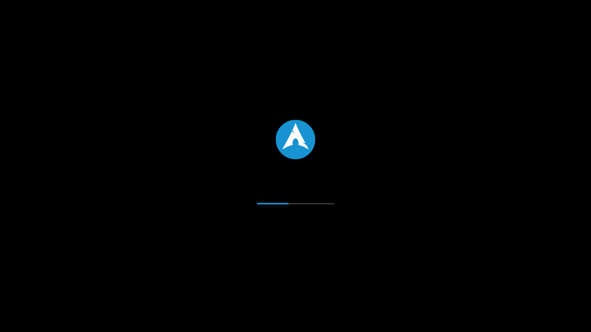

# LiberSplash

This Boot Splash Screen theme adds a stylish visual effect when booting your operating system.

## Installation

1. Clone the repository

    ```bash
    git clone https://github.com/CelestifyX/LiberSplash.git
    ```

2. Navitate to the project directory:
    ```bash
    cd LiberSplash
    ```

3. Make `install` file executable:
    ```bash
    chmod +x ./install
    ```

4. Run `./install` to install LiberSplash:
    ```bash
    ./install
    ```

5. Select a theme in your DE settings, or install a theme with the command
6. Reboot the system to apply the settings

## Screenshots


